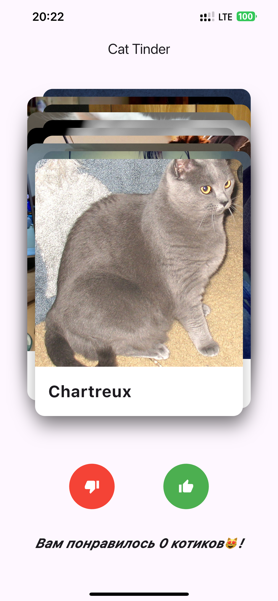
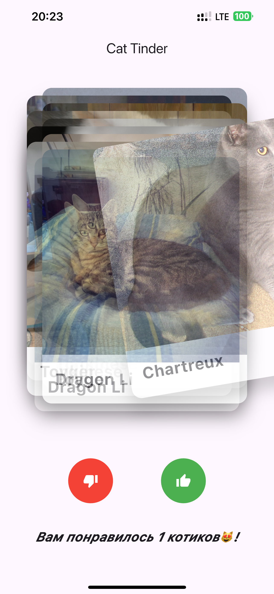
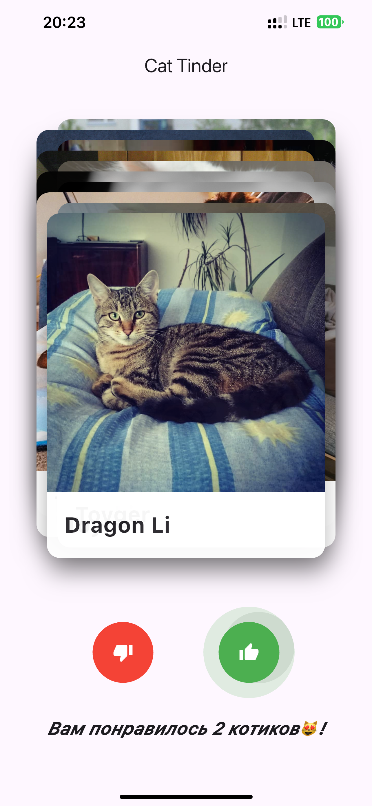
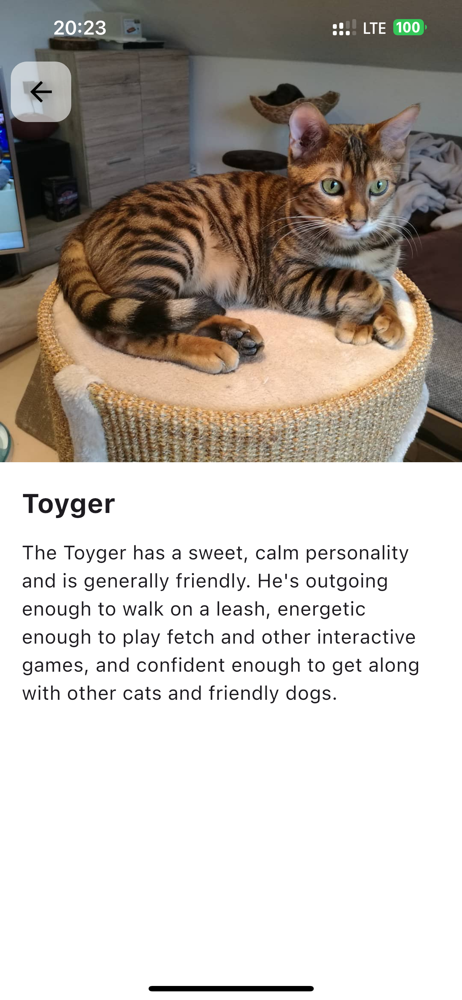

# Cat Tinder
Tinder, but for cats, and it's PRO!
[Ссылка на скачивание](https://github.com/Ero-Sennin9/cat_tinder/releases/download/first-version/app-release.apk)

## Функционал приложения
1. На главном экране отображается случайное изображение котика и название его породы
2. Изображение котика можно свайпнуть или смахнуть влево или вправо
3. Также есть две кнопки: лайк/дизлайк
4. Смахивание, свайп или нажатие на кнопку должно сменяет котика на нового
5. Если котика лайкнули (лайк или свайп вправо), то на экране увеличивается
   счетчик лайкнутых котиков
6. Если нажать на само изображение котика, то открывается новый экран с
   детальным описанием
7. На экране детального описания отображается изображение котика, плюс
   отображается вся информация про его породу
8. Добавляется экран лайкнутых котиков, со скроллящимся списком всех лайкнутых котиков. Хранятся только в рантайме, после перезагрузки приложения список пуст.
9. Экран лайкнутых котиков отображает список с изображением, породой и датой лайка.
10. В списке есть с возможность удаления карточки из списка. 
11. Фильтрация по породе работает на этих экранах лайков (выпадающий список). 
12. При выборе породы в фильтре список обновляется мгновенно.
13. При длительной загрузке приложение показывает progress bar. 
14. При ошибке сети отображается диалог с ошибкой.

## Скриншоты (Old version)

## Скриншоты (Pro version)

